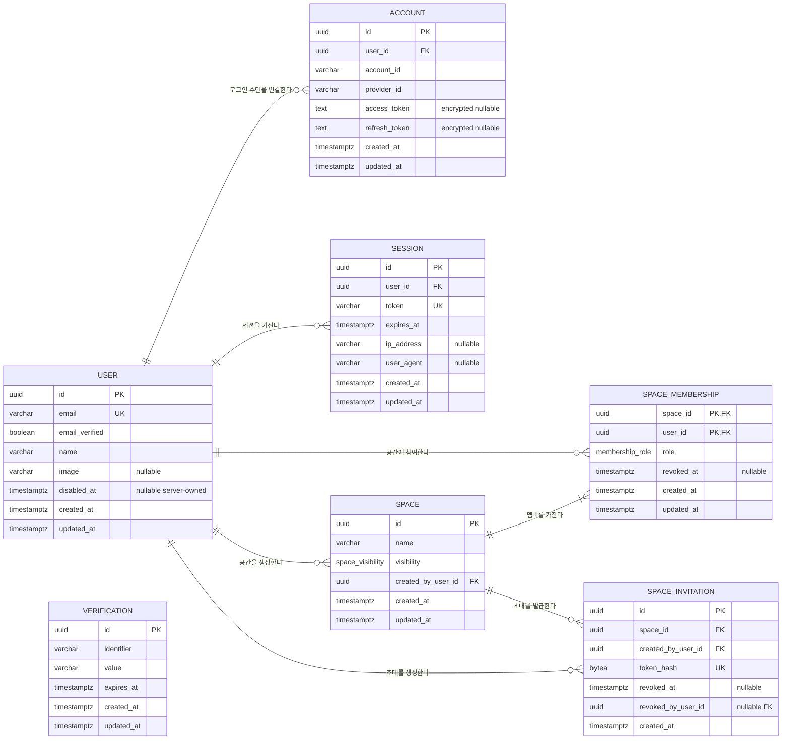
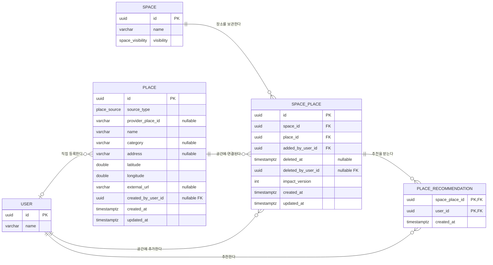
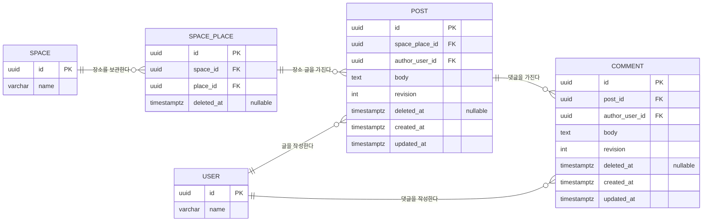

# 같가가 ERD v0.1

- 최종 업데이트: 2026-09-06
- 상태: **구현 기준선 — 첫 Prisma migration 적용·검증 완료**
- 인증 결정: [`../adr/0002-authentication-with-better-auth.md`](../adr/0002-authentication-with-better-auth.md)
- 제품 기준: [`../product/prd-v1.0.md`](../product/prd-v1.0.md)
- 관계 개요: [같가가 P0 ERD FigJam](https://www.figma.com/board/dilV1C9TVEYGCfRO4bUPhh)
- 문서 역할: P0 Private Alpha 데이터 의미·관계·제약의 단일 기준

## 1. 설계 원칙

1. 인증과 제품 데이터는 같은 PostgreSQL에 두되 모듈 소유권을 분리한다.
2. 다대다 관계와 사용자 행동은 연결 테이블로 정규화한다.
3. 중복과 권한 무결성은 UI가 아니라 FK, unique, transaction과 서버 정책으로 보장한다.
4. soft delete 대상은 원본 행을 재사용해 복구하고, 같은 의미의 새 행을 만들지 않는다.
5. 확인된 P1 확장 지점만 보존하고 랭킹·신고·이미지 등 미확정 테이블은 미리 만들지 않는다.

다이어그램은 논리 PostgreSQL 타입을 사용한다. 정확한 길이, enum, `ON DELETE`와 부분 인덱스는 아래 사전에 정의하고 Prisma schema·SQL migration은 다음 단계에서 생성한다.

## 2. 인증과 공간 접근



`Verification`은 Better Auth가 OAuth state 등 단기 검증 데이터에 사용할 수 있는 독립 테이블이다. 제품 도메인이 직접 참조하지 않으며 만료 데이터 정리는 인증 모듈이 담당한다.

## 3. 장소 수집과 추천



`Place`는 장소 사실, `SpacePlace`는 특정 공간에 저장했다는 관계다. 장소 제거는 `Place`를 삭제하지 않고 `SpacePlace.deletedAt`을 채운다. 직접 등록 장소도 고유 `Place`로 만들되 다른 Space의 검색 후보로 자동 노출하거나 병합하지 않는다.

## 4. 장소 글과 댓글



P0의 Post는 반드시 하나의 `SpacePlace`에 속한다. `spaceId`는 `Post → SpacePlace → Space`로 유도하므로 중복 저장하지 않는다. P1 일반 Space 글이 확정되면 `Post.spaceId`를 backfill하고 `spacePlaceId`를 nullable로 바꾼다. P2 다중 장소 첨부가 실제 요구가 될 때 `PostPlace` 연결 테이블을 추가한다.

## 5. 데이터 사전

### Better Auth 소유

| 테이블 | 책임 | 핵심 규칙 |
| --- | --- | --- |
| `User` | 내부 사용자 루트와 Kakao 프로필 snapshot | `email` unique, `disabledAt`은 서버 전용 접근 차단 값 |
| `Account` | Kakao 등 외부 로그인 수단 | `(providerId, accountId)` unique, token 암호화 |
| `Session` | DB 기반 로그인 세션 | `token` unique, 만료·사용자 조회 index |
| `Verification` | 단기 검증 값 | `identifier` index, 만료 행 정리 |

P0에는 별도 `ProductUser`나 `UserProfile`을 만들지 않는다. `disabledAt`만 Better Auth `additionalFields`로 확장하고 입력·응답에서 숨긴다. 제품에서 프로필을 직접 편집해야 할 때만 `UserProfile`을 추가한다. Better Auth가 요구하는 나머지 token·만료 column은 실제 설치 버전의 CLI 생성 결과를 임의로 제거하지 않는다.

### 공간과 접근

| 테이블 | 책임 | 핵심 규칙 |
| --- | --- | --- |
| `Space` | 지속되는 장소 협업 단위 | name 1~40자, P0 생성은 `PRIVATE`만 허용 |
| `SpaceMembership` | User와 Space의 역할·활성 관계 | `(spaceId, userId)` unique, `revokedAt IS NULL`이면 활성 |
| `SpaceInvitation` | 공유 가능한 초대 권한 | 원문 대신 SHA-256 hash 저장, 자동 만료 없음 |

- `Space.visibility`는 `PRIVATE | PUBLIC`이다. P0 API는 `PRIVATE`만 입력받고 P1에서 `PUBLIC`을 연다.
- `Space.createdByUserId`는 감사 정보이고 현재 Owner는 Membership의 `role`로 판단한다. 둘은 생성자와 현재 권한이라는 서로 다른 사실이다.
- 활성 Owner는 Space당 최대 1명이다. 최소 1명 유지는 생성·이전 transaction으로 보장한다.
- 활성 Invitation도 Space당 최대 1명이다. 재발급 transaction은 기존 행을 폐기하고 새 행을 만든다.

### 장소와 콘텐츠

| 테이블 | 책임 | 핵심 규칙 |
| --- | --- | --- |
| `Place` | Provider·직접 등록 장소의 사실 | 좌표 필수, Kakao ID는 Provider 범위에서 unique |
| `SpacePlace` | Space에 저장된 Place | `(spaceId, placeId)` unique, soft delete 후 같은 행 복구, 동시성 version |
| `PlaceRecommendation` | 멤버의 추천 사실 | `(spacePlaceId, userId)` composite PK, P0 취소 없음 |
| `Post` | Space에 속한 작성자 소유 글 | 본문 1~1,000자, soft delete |
| `Comment` | Post의 평면 댓글 | 본문 1~1,000자, soft delete, P0 대댓글 없음 |

- 좌표는 PostgreSQL `double precision`을 사용하고 범위 CHECK를 둔다. 거리 검색이 필요할 때 PostGIS를 검토한다.
- `Place.sourceType`은 `KAKAO | USER`다. `KAKAO`면 `providerPlaceId`가 필수이고 `createdByUserId`는 null이다. `USER`면 반대로 직접 등록자를 보존한다. Kakao 장소를 공간에 가져온 사람은 `SpacePlace.addedByUserId`로 표현한다.
- `SpacePlace.deletedByUserId`는 Owner가 다른 사용자의 장소 연결을 제거할 수 있어 필요하다. Post·Comment는 작성자만 삭제하므로 별도 `deletedBy`를 중복 저장하지 않는다.
- P1 대댓글은 `Comment.parentId`와 depth CHECK를 migration으로 추가한다. 지금 nullable column을 미리 만들지 않는다.

## 6. DB 제약과 인덱스

Prisma schema만으로 표현할 수 없는 부분 인덱스와 CHECK는 생성된 migration SQL에 직접 추가하고 integration test로 유지한다.

| 목적 | PostgreSQL 제약·인덱스 |
| --- | --- |
| 외부 계정 중복 방지 | `UNIQUE (provider_id, account_id)` |
| 공간 중복 가입 방지 | `UNIQUE (space_id, user_id)` |
| 활성 Owner 최대 1명 | `UNIQUE (space_id) WHERE role = 'OWNER' AND revoked_at IS NULL` |
| 활성 초대 최대 1개 | `UNIQUE (space_id) WHERE revoked_at IS NULL` |
| Kakao 장소 중복 방지 | `UNIQUE (source_type, provider_place_id) WHERE provider_place_id IS NOT NULL` |
| 같은 공간의 장소 중복 방지 | `UNIQUE (space_id, place_id)` |
| 사용자별 추천 중복 방지 | `UNIQUE (space_place_id, user_id)` |
| 내 공간 목록 | `INDEX (user_id, revoked_at, created_at DESC)` |
| 공간 장소 목록 | `INDEX (space_id, deleted_at, created_at DESC)` |
| 장소 글 목록 | `INDEX (space_place_id, deleted_at, created_at DESC)` |
| 댓글 목록 | `INDEX (post_id, deleted_at, created_at)` |
| 세션 검사·정리 | `UNIQUE (token)`, `INDEX (user_id, expires_at)`, `INDEX (expires_at)` |

추가 CHECK:

- `char_length(trim(space.name)) BETWEEN 1 AND 40`
- `char_length(btrim(post.body)) BETWEEN 1 AND 1000`
- `char_length(btrim(comment.body)) BETWEEN 1 AND 1000`
- `latitude BETWEEN -90 AND 90`
- `longitude BETWEEN -180 AND 180`
- `KAKAO`는 `providerPlaceId`만, `USER`는 `createdByUserId`만 필수인 출처별 필드 쌍
- `impactVersion >= 0`
- `Post.revision >= 1`, `Comment.revision >= 1`
- `SpacePlace.deletedAt`과 `deletedByUserId`는 둘 다 null이거나 둘 다 값임
- `SpaceInvitation.revokedAt`과 `revokedByUserId`는 둘 다 null이거나 둘 다 값임
- `octet_length(tokenHash) = 32`

## 7. FK와 삭제 정책

- Better Auth의 `Account.userId`, `Session.userId`는 User 물리 삭제 시 cascade할 수 있다.
- 제품 데이터가 참조하는 User와 Space는 기본 `RESTRICT`로 두고 삭제 순서를 명시적으로 운영한다.
- SpacePlace 제거는 자식 추천·글·댓글을 수정하지 않는다. 활성 조회에서 삭제된 SpacePlace를 join 조건으로 제외한다.
- P0에는 정기 물리 삭제 job을 두지 않는다. 보존 기간과 익명화 정책은 Public 출시 전 별도 ADR로 정한다.

## 8. 원자성·동시성 규칙

### 공간과 초대

- `createSpace`: Space와 Owner Membership을 한 transaction에서 생성한다.
- `rotateInvitation`: 활성 초대를 폐기하고 새 hash를 생성한다. 부분 unique가 동시 재발급 중복을 막는다.
- `acceptInvitation`: 활성 초대와 User를 확인하고 Membership을 upsert한다. unique 충돌은 이미 참여한 멱등 성공으로 처리한다.

### 장소와 기여

- `addPlaceToSpace`: Place upsert → SpacePlace upsert → 최초 Recommendation insert를 한 transaction에서 처리한다.
- 삭제된 SpacePlace가 unique에 걸리면 자동 복구하지 않고 `RESTORE_REQUIRED`를 반환한다.
- 추천·Post·Comment의 생성·수정·삭제 transaction은 먼저 `deletedAt IS NULL`인 SpacePlace의 `impactVersion`을 원자적으로 1 증가시킨다. 갱신된 행이 없으면 기여를 만들지 않는다.
- 장소 제거 확인 응답은 최신 기여 수와 `impactVersion`을 함께 반환한다.
- 장소 제거는 `deletedAt IS NULL AND impactVersion = observedVersion` 조건으로 SpacePlace를 갱신한다. 영향 확인 뒤 다른 기여가 생기면 0행이 갱신되고 `IMPACT_CHANGED`를 반환한다.
- 모든 쓰기 경로가 서버 모듈을 통과하는 P0에서는 DB trigger를 두지 않는다. 다른 writer가 생기면 version 갱신을 trigger로 승격한다.

### 콘텐츠

- Post·Comment update/delete 조건에는 `authorUserId`, `revision`과 `deletedAt IS NULL`을 함께 포함하고 성공 시 revision을 1 증가시킨다.
- 삭제와 복구 API는 영향받은 행 수가 1인지 확인하고 0이면 최신 상태를 다시 조회해 idempotent·conflict 응답을 구분한다.

## 9. 권한 조회 원칙

```text
Private 읽기·쓰기
= Session 유효
AND User.disabledAt IS NULL
AND SpaceMembership.revokedAt IS NULL

Post 수정·삭제
= Private 쓰기 권한
AND Post.authorUserId = Session.user.id
AND Post.deletedAt IS NULL
```

P1 Public 읽기는 `Space.visibility = PUBLIC`이면 비로그인에도 허용한다. 쓰기는 Public이어도 활성 Membership이 필요하다. 객체 ID만으로 조회·수정하지 않고 항상 Space 경계까지 join해 검사한다.

## 10. 구현 순서와 검증

1. **완료** — Docker PostgreSQL 18.4와 Prisma 7.10.0, Better Auth 1.7.3 config를 구성한다.
2. **완료** — `auth generate` 결과와 이 ERD를 비교해 하나의 `schema.prisma`로 합친다.
3. **완료** — 첫 migration에 부분 인덱스·CHECK·FK 정책을 보강하고 실제 PostgreSQL smoke test를 통과한다.
4. **다음** — `Kakao 로그인 → createSpace → 초대 복귀 → acceptInvitation` 세로 기능을 integration test와 함께 구현한다.
5. 장소 추가·추천·글·댓글·제거의 transaction과 `impactVersion` 동시성 test를 차례로 연결한다.

최소 검증 시나리오:

- 같은 Kakao 계정의 동시 첫 로그인에도 User·Account가 하나다.
- 같은 초대를 동시에 수락해도 Membership이 하나다.
- 같은 Kakao 장소를 동시에 추가해도 Place·SpacePlace가 하나다.
- 장소 제거와 추천 추가가 경쟁해도 새 기여가 유실되지 않는다.
- 다른 Space·다른 작성자의 ID를 알아도 읽기·수정·삭제할 수 없다.
- User가 비활성화되거나 Session이 폐기되거나 Membership이 취소되면 즉시 Private 접근이 막힌다.

## 11. 의도적으로 미룬 것

- Public 가입·Ban·신고 테이블
- 이미지 `Media`와 S3 lifecycle
- 대댓글·태그
- 방문 상태·방문 기록
- 랭킹 counter와 검색 인덱스
- PostGIS와 현재 위치 검색
- Redis·session cookie cache
- 물리 삭제·아카이브 job

이 항목은 P1 요구와 실제 쿼리를 확인한 뒤 additive migration으로 추가한다.
